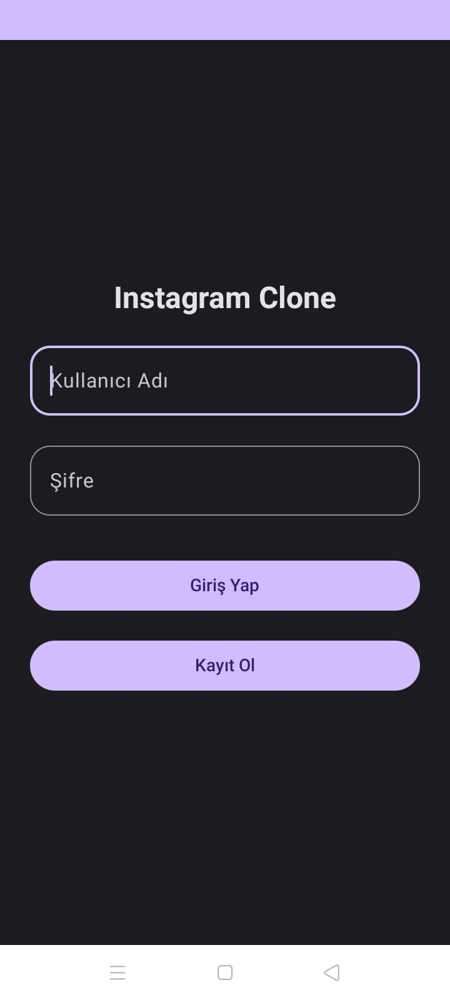
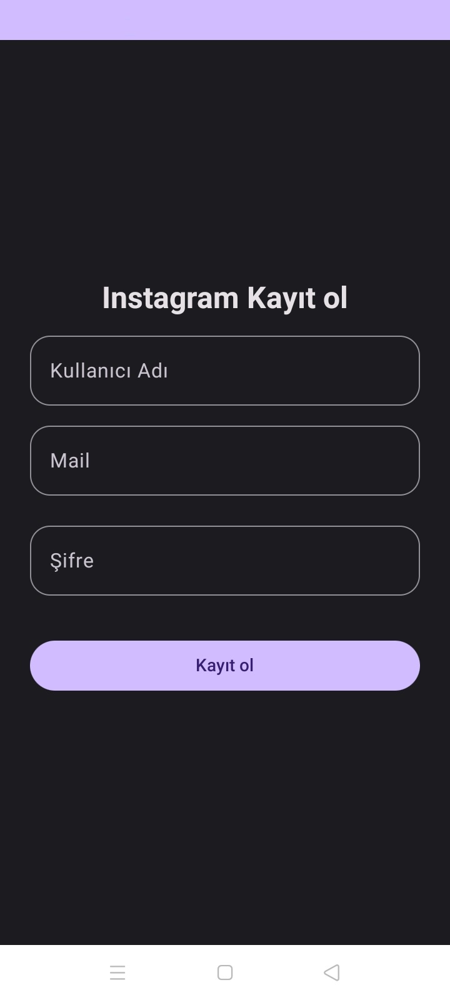
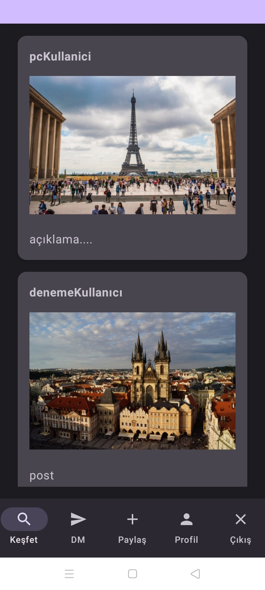
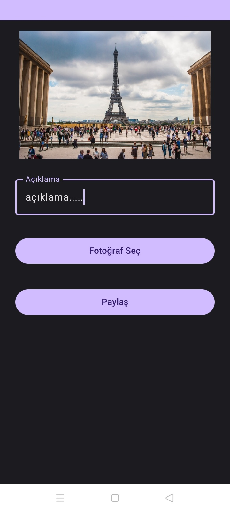
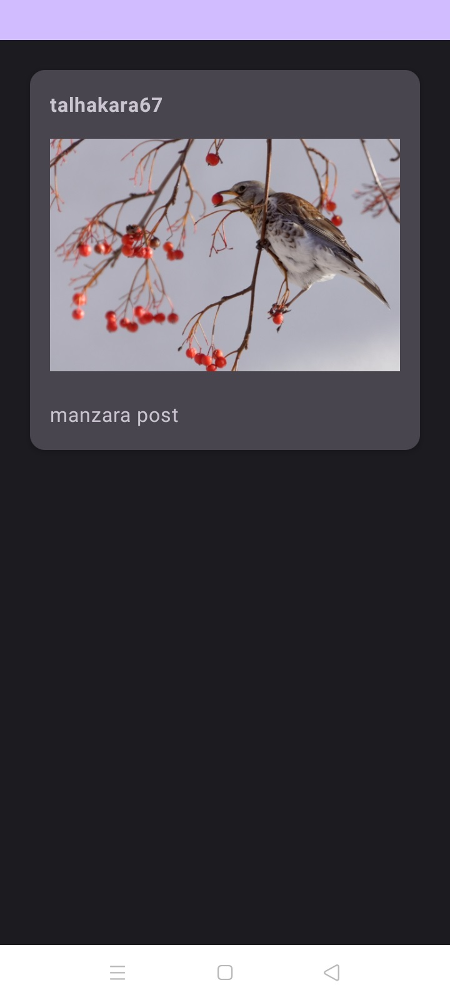

# Instagram Klonu

Bu repo, Instagram benzeri bir sosyal medya uygulamasının temel özelliklerini içeren bir klonun kaynak kodlarını içerir.

## Ekran Görüntüleri

##Giriş Yap

##Kayıt Ol

##Keşfet

##Gönderi Paylaş

##Profil

## Klonun Genel Özellikleri

- Giriş yapma ve kayıt olma
- Keşfet bölümü
- Gönderi paylaşma 
- Kullanıcı profili görüntüleme 

## Nasıl Kullanılır

1. Repo'yu bilgisayarınıza klonlayın:
2. Uygulamayı yerel ortamınıza kurun.
3. Uygulamayı çalıştırın ve tarayıcınızda 

## Katkıda Bulunma

Eğer projeye katkıda bulunmak isterseniz, lütfen aşağıdaki adımları izleyin:

1. Bu depoyu kendi GitHub hesabınıza çatallayın (fork).
2. Yeni bir özellik eklemek veya hata düzeltme yapmak için yeni bir dal (branch) oluşturun: `git checkout -b yenidall-adı`
3. Yaptığınız değişiklikleri taahhüt edin (commit): `git commit -m 'Yaptığınız değişikliklerin açıklaması'`
4. Değişikliklerinizi kendi fork dalınıza (branch) gönderin: `git push origin yenidall-adı`
5. Pull isteği (pull request) oluşturun ve değişikliklerinizi ana repoya eklemek için bekleyin.

